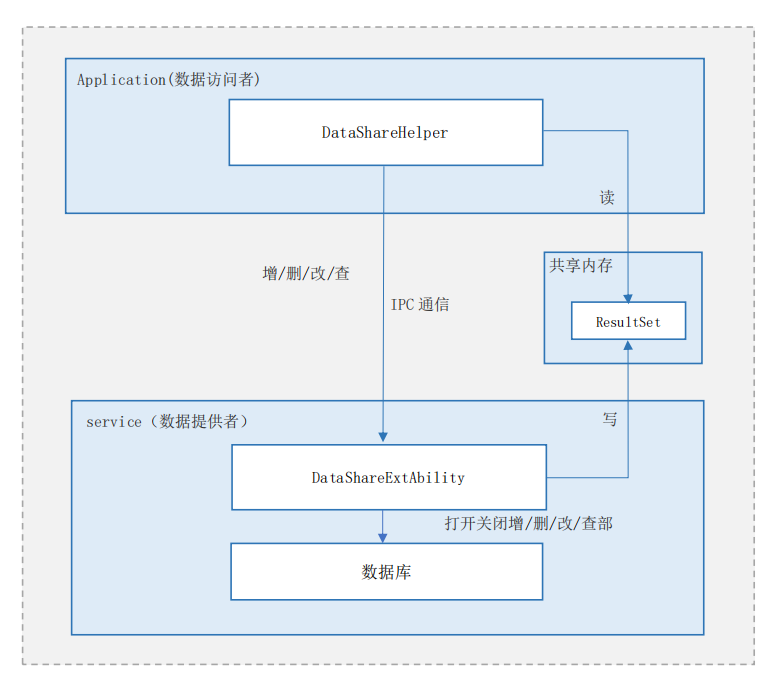

# 数据共享

## 简介

**数据共享（Data Share）** 提供了向其他应用共享以及管理其数据的方法，支持同个设备上不同应用之间的数据共享。

**图 1**  逻辑架构图



- DataShareExtAbility模块为数据提供方，实现跨应用数据共享的相关业务。
- DataShareHelper模块为数据访问方，提供各种访问数据的接口，包括增删改查等。
- 数据访问方与提供方通过IPC进行通信，数据提供方可以通过数据库实现，也可以通过其他数据存储方式实现。
- ResultSet模块通过共享内存实现，用于存储查询数据得到的结果集，并提供了遍历结果集的方法。

## 目录

```
/foundation/distributeddatamgr/data_share
├── frameworks                                   # 框架代码
│   ├── js
│   │   └── napi                                 # NAPI代码存放目录
│   │       ├── common                           # 公用NAPI代码存放目录
│   │       ├── dataShare                        # 客户端NAPI代码存放目录
│   │       ├── datashare_ext_ability            # DataShareExtentionAbility模块JS代码存放目录
│   │       └── datashare_ext_ability_context    # DataShareExtentionAbilityContext模块JS代码存放目录
│   └── native
│       ├── common
│       ├── consumer
│       └── provider
└── interfaces                                   # 对外接口存放目录
    └── inner_api                                # 对内部子系统暴露的头文件存放目录
        ├── common                               # 公用对内部子系统暴露的头文件存放目录
        ├── consumer                             # 客户端对内部子系统暴露的头文件存放目录
        └── provider                             # 服务端对内部子系统暴露的头文件存放目录
```


## 约束

- DataShare受到数据提供方所使用数据库的一些限制。例如支持的数据模型、Key的长度、Value的长度、每个应用程序支持同时打开数据库的最大数量等，都会受到使用的数据库的限制。
- 因DataShare内部实现依赖于IPC通信，所以数据集、谓词、结果集等的载荷受到IPC通信的约束与限制。

## 相关仓

[分布式数据管理子系统](https://gitee.com/openharmony/distributeddatamgr_data_share/blob/master/README_zh.md)

[distributeddatamgr_datamgr](https://gitee.com/openharmony/distributeddatamgr_datamgr/blob/master/README_zh.md)

[**distributeddatamgr_data_share**](https://gitee.com/openharmony/distributeddatamgr_data_share/blob/master/README_zh.md)