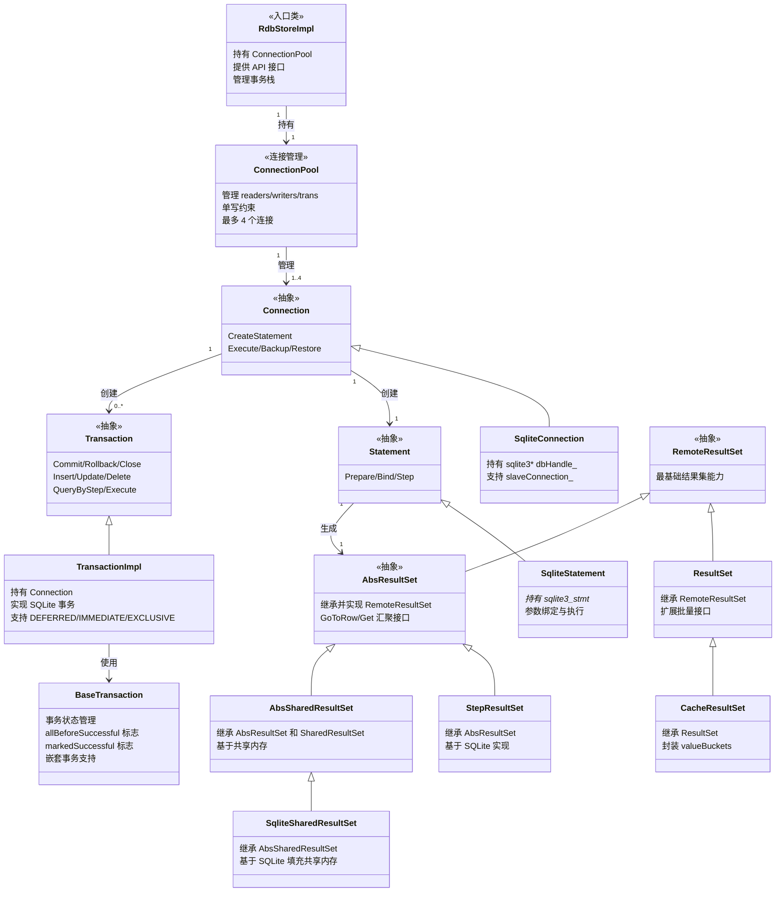

# RDB Native Implementation

本目录包含 relational_store 的 Native 层核心实现。

## 核心类关系图



### 关系说明

- **RdbStoreImpl → ConnectionPool**: 1:1 持有关系
- **ConnectionPool → Connection**: 1:1..4，最多管理 4 个连接
- **Connection → Statement**: 1:1 创建关系
- **Connection → Transaction**: 1:0..*，一个连接可以创建多个事务
- **Statement → AbsResultSet**: 1:1 生成关系
- **TransactionImpl → BaseTransaction**: 使用 BaseTransaction 管理事务状态
- 继承关系：`SqliteConnection`、`SqliteStatement`、`TransactionImpl`、`StepResultSet`、`CacheResultSet`、`AbsSharedResultSet`、`SqliteSharedResultSet` 分别继承自抽象接口

## 核心类职责

### RdbStoreImpl
**文件**: `src/rdb_store_impl.cpp`, `include/rdb_store_impl.h`

入口类，实现 `interfaces/inner_api/rdb/include/rdb_store.h` 定义的接口。持有 `ConnectionPool` 负责连接管理和事务协调，管理分布式同步、云同步、观察者注册等功能。

### ConnectionPool
**文件**: `src/connection_pool.cpp`, `include/connection_pool.h`

管理三种连接池（`readers_`、`writers_`、`trans_`），提供 `Acquire`/`Release` 语义管理连接生命周期。**硬限制**：最多 4 个连接，同时只能有一个写操作。

### Connection (抽象) → SqliteConnection
**文件**: `include/connection.h`, `include/sqlite_connection.h`, `src/sqlite_connection.cpp`

`Connection` 是抽象接口，负责**连接级别操作**，功能内聚。支持多种数据库内核。`SqliteConnection` 是 SQLite 实现，持有 `sqlite3 *dbHandle_` 和可选的 `slaveConnection_`，提供 `CreateStatement`、`Execute`、`Backup`、`Restore`、`LimitWalSize` 等操作。**增加接口需谨慎评估**，确保功能确实属于连接级别。

### Transaction (抽象) → TransactionImpl
**文件**: `interfaces/inner_api/rdb/include/transaction.h`, `frameworks/native/rdb/include/transaction_impl.h`

`Transaction` 是事务抽象接口，定义 `Commit`、`Rollback`、`Close` 以及 `Insert`、`Update`、`Delete`、`QueryByStep`、`Execute` 等操作。`TransactionImpl` 是 SQLite 实现，支持三种事务类型（DEFERRED、IMMEDIATE、EXCLUSIVE），持有 `Connection` 和 `RdbStore` 引用。

### Statement (抽象) → SqliteStatement
**文件**: `include/statement.h`, `include/sqlite_statement.h`, `src/sqlite_statement.cpp`

`Statement` 是 SQL 语句抽象接口。`SqliteStatement` 是 SQLite 实现，提供参数绑定（`Bind`）和执行（`Step`、`Execute`）功能，支持特殊类型（Asset、BigInt、FloatVector 等）。

### ResultSet 继承体系

**继承链路**：

- **RemoteResultSet**：定义结果集最基础能力
- **ResultSet**：继承 RemoteResultSet，扩展批量接口
- **AbsResultSet**：继承并实现 RemoteResultSet，将移动操作汇聚到 `GoToRow`，将 Get 操作汇聚到 `Get`，减少子类需实现的接口
- **StepResultSet**：继承 AbsResultSet，基于 SQLite 实现 `GoToRow`、`Get`、`GetColumnType`、`GetSize`
- **CacheResultSet**：继承 ResultSet，封装 valueBuckets 实现 ResultSet 能力
- **AbsSharedResultSet**：继承 AbsResultSet 和 SharedResultSet，基于共享内存实现 `GoToRow` 和 `Get`
- **SqliteSharedResultSet**：继承 AbsSharedResultSet，基于 SQLite 实现共享内存填充和遍历

## 目录结构

```
rdb/
├── include/                    # 头文件
│   ├── rdb_store_impl.h        # RdbStoreImpl
│   ├── connection_pool.h       # ConnectionPool
│   ├── connection.h            # Connection 抽象接口
│   ├── sqlite_connection.h     # SqliteConnection
│   ├── statement.h             # Statement 抽象接口
│   ├── sqlite_statement.h      # SqliteStatement
│   ├── abs_result_set.h        # AbsResultSet 抽象接口
│   ├── abs_shared_result_set.h # AbsSharedResultSet 抽象接口
│   ├── transaction.h           # Transaction 抽象接口
│   ├── transaction_impl.h      # TransactionImpl
│   ├── rdb_predicates.h        # 谓词
│   └ ...                       # 其他头文件
│
└── src/                        # 源文件
    ├── rdb_store_impl.cpp      # RdbStoreImpl 实现
    ├── connection_pool.cpp     # ConnectionPool 实现
    ├── sqlite_connection.cpp   # SqliteConnection 实现
    ├── sqlite_statement.cpp    # SqliteStatement 实现
    ├── transaction.cpp         # Transaction 实现
    ├── transaction_impl.cpp    # TransactionImpl 实现
    ├── step_result_set.cpp     # StepResultSet 实现
    ├── cache_result_set.cpp    # CacheResultSet 实现
    ├── rdb_predicates.cpp      # 谓词实现
    └ ...                       # 其他源文件
```
