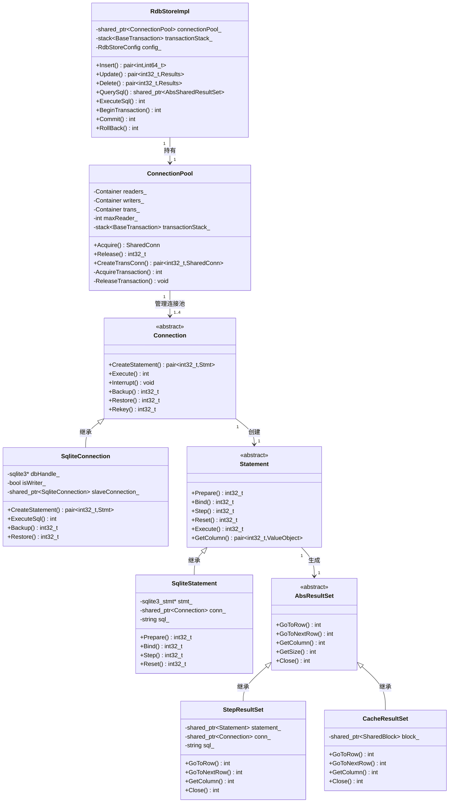

# RDB Native Implementation

本目录包含 relational_store 的 Native 层核心实现。

## 核心类关系图



### 类图说明

**关系说明**:
- **RdbStoreImpl → ConnectionPool**: 1 对 1，RdbStoreImpl 持有 ConnectionPool
- **ConnectionPool → Connection**: 1 对 1..4，ConnectionPool 管理连接池（最多4个）
- **Connection → Statement**: 1 对 1，Connection 创建 Statement
- **Statement → AbsResultSet**: 1 对 1，Statement 生成 AbsResultSet
- **继承关系**: Connection/Statement/AbsResultSet 是抽象接口，有具体实现

**关键基数**:
- `ConnectionPool` 最多管理 4 个 `Connection`
- 每个 `Connection` 可以创建多个 `Statement`（但通常一次一个活跃的）
- 每个 `Statement` 对应一个 `AbsResultSet`

## 核心类说明

### RdbStoreImpl
**文件**: `src/rdb_store_impl.cpp`, `include/rdb_store_impl.h`

**职责**:
- 入口类，实现 `interfaces/inner_api/rdb/include/rdb_store.h` 定义的接口
- 持有 `ConnectionPool`，负责连接管理和事务协调
- 提供高层 API：`ExecuteSql`、`Insert`、`Update`、`Delete`、`Query` 等
- 管理分布式同步、云同步、观察者注册等功能

**关键成员**:
- `connectionPool_`: 连接池指针
- `transactionStack_`: 事务栈
- `config_`: 数据库配置
- `isOpen_`: 数据库是否打开

### ConnectionPool
**文件**: `src/connection_pool.cpp`, `include/connection_pool.h`

**职责**:
- 管理三种连接池：`readers_`（读连接）、`writers_`（写连接）、`trans_`（事务连接）
- 最多 4 个连接（`maxReader_` 配置）
- 提供 `Acquire`/`Release` 语义管理连接生命周期
- 管理事务栈（`transactionStack_`）保证单写约束

**关键成员**:
- `readers_`: 读连接池
- `writers_`: 写连接池
- `trans_`: 事务连接池
- `transactionStack_`: 事务栈
- `maxReader_`: 最大读连接数（默认 3）

**约束**:
- **硬限制**: 最多 4 个连接（包括读写连接）
- **单写约束**: 同一时间只能有一个写操作

### Connection (抽象) → SqliteConnection
**文件**: `include/connection.h`, `include/sqlite_connection.h`, `src/sqlite_connection.cpp`

**职责**:
- `Connection` 是抽象接口，支持多种数据库内核（通过注册 Creator）
- `SqliteConnection` 是 SQLite 实现
- 每个连接持有 `sqlite3 *dbHandle_` 和可选的 `slaveConnection_`
- 提供数据库操作：`CreateStatement`、`Execute`、`Backup`、`Restore` 等

**关键成员**:
- `dbHandle_`: SQLite 数据库句柄
- `slaveConnection_`: 副本连接（用于主从同步）
- `isWriter_`: 是否为写连接
- `config_`: 数据库配置

### Statement (抽象) → SqliteStatement
**文件**: `include/statement.h`, `include/sqlite_statement.h`, `src/sqlite_statement.cpp`

**职责**:
- `Statement` 是 SQL 语句抽象接口
- `SqliteStatement` 是 SQLite 实现
- 提供参数绑定（`Bind`）和执行（`Step`、`Execute`）功能
- 支持特殊类型：Asset、BigInt、FloatVector 等

**关键成员**:
- `stmt_`: SQLite 语句句柄
- `conn_`: 关联的连接
- `sql_`: SQL 语句字符串
- `bound_`: 是否已绑定参数

### AbsResultSet → StepResultSet / CacheResultSet
**文件**:
- `include/abs_result_set.h`, `include/step_result_set.h`, `src/step_result_set.cpp`
- `include/cache_result_set.h`, `src/cache_result_set.cpp`

**职责**:
- `AbsResultSet` 是结果集抽象接口
- `StepResultSet`：逐行查询，持有 Statement，适合大数据量
- `CacheResultSet`：缓存结果集到 SharedBlock，支持跨进程共享
- 提供统一的数据访问接口：`GoToRow`、`GetColumn`、`GetRow` 等

**关键成员**:
- `statement_`: 关联的语句（StepResultSet）
- `conn_`: 关联的连接
- `block_`: 共享内存块（CacheResultSet）

## 目录结构

```
rdb/
├── include/                    # 头文件
│   ├── rdb_store_impl.h        # RdbStoreImpl
│   ├── connection_pool.h       # ConnectionPool
│   ├── connection.h            # Connection 抽象接口
│   ├── sqlite_connection.h     # SqliteConnection
│   ├── statement.h             # Statement 抽象接口
│   ├── sqlite_statement.h      # SqliteStatement
│   ├── abs_result_set.h        # AbsResultSet 抽象接口
│   ├── step_result_set.h       # StepResultSet
│   ├── cache_result_set.h      # CacheResultSet
│   ├── transaction.h           # 事务管理
│   ├── rdb_predicates.h        # 谓词
│   └── ...                     # 其他头文件
│
└── src/                        # 源文件
    ├── rdb_store_impl.cpp      # RdbStoreImpl 实现
    ├── connection_pool.cpp     # ConnectionPool 实现
    ├── sqlite_connection.cpp   # SqliteConnection 实现
    ├── sqlite_statement.cpp    # SqliteStatement 实现
    ├── step_result_set.cpp     # StepResultSet 实现
    ├── cache_result_set.cpp    # CacheResultSet 实现
    ├── transaction.cpp         # 事务管理实现
    ├── rdb_predicates.cpp      # 谓词实现
    └── ...                     # 其他源文件
```
